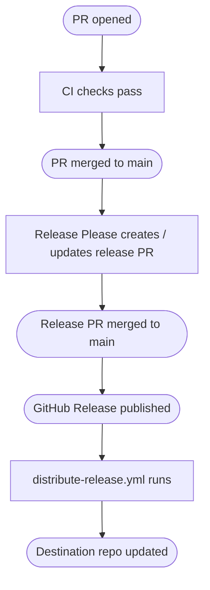
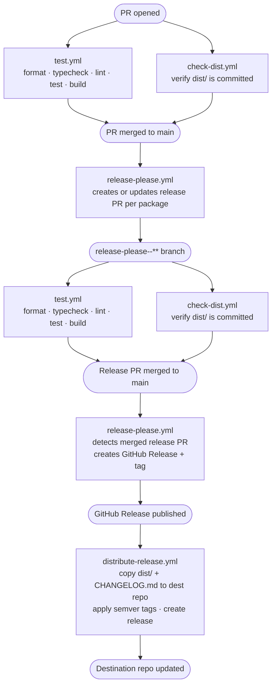

# Workflow Diagrams

End-to-end flow of changes from pull request to destination repository, at three levels of detail.

## High-level

```mermaid
flowchart TD
    A([PR opened])
    B[CI checks pass]
    C([PR merged to main])
    D[Release Please creates / updates release PR]
    E([Release PR merged to main])
    F([GitHub Release published])
    G[distribute-release.yml runs]
    H([Destination repo updated])

    A --> B --> C --> D --> E --> F --> G --> H
```

## Mid-level

```mermaid
flowchart TD
    PR([PR opened])

    PR --> test_pr["test.yml\nformat · typecheck · lint · test · build"]
    PR --> check_dist["check-dist.yml\nverify dist/ is committed"]

    test_pr --> Merge([PR merged to main])
    check_dist --> Merge

    Merge --> rp1["release-please.yml\ncreates or updates release PR per package"]
    rp1 --> RPBranch([release-please--** branch])

    RPBranch --> test_rp["test.yml\nformat · typecheck · lint · test · build"]
    RPBranch --> check_dist_rp["check-dist.yml\nverify dist/ is committed"]

    test_rp --> RPMerge([Release PR merged to main])
    check_dist_rp --> RPMerge

    RPMerge --> rp2["release-please.yml\ndetects merged release PR\ncreates GitHub Release + tag"]
    rp2 --> GHRelease([GitHub Release published])

    GHRelease --> distribute["distribute-release.yml\ncopy dist/ + CHANGELOG.md to dest repo\napply semver tags · create release"]
    distribute --> Done([Destination repo updated])
```

## Detailed

```mermaid
flowchart TD
    PR_Open([PR opened])
    PR_Open --> pr_test_1
    PR_Open --> pr_dist_1

    subgraph test_pr["test.yml — on: pull_request"]
        pr_test_1[Checkout]
        pr_test_2[Setup Node.js 24]
        pr_test_3[npm ci]
        pr_test_4["npm run all\nformat · typecheck · lint · test · build"]
        pr_test_1 --> pr_test_2 --> pr_test_3 --> pr_test_4
    end

    subgraph check_dist["check-dist.yml — on: pull_request to main"]
        pr_dist_1[Checkout]
        pr_dist_2[Setup Node.js 24]
        pr_dist_3[npm ci]
        pr_dist_4[npm run build]
        pr_dist_5{dist/ up to date?}
        pr_dist_fail[/"❌ Fail: run npm run build and commit"/]
        pr_dist_1 --> pr_dist_2 --> pr_dist_3 --> pr_dist_4 --> pr_dist_5
        pr_dist_5 -- No --> pr_dist_fail
    end

    pr_test_4 --> Merge([PR merged to main])
    pr_dist_5 -- Yes --> Merge

    Merge --> m1_rp_1

    subgraph rp_wf1["release-please.yml — on: push to main"]
        m1_rp_1["googleapis/release-please-action\ntoken: RELEASE_PLEASE_TOKEN"]
        m1_rp_2{releases_created?}
        m1_rp_3["Remove autorelease:pending label\nfrom other open release PRs"]
        m1_rp_4[Re-trigger release-please.yml]
        m1_rp_1 --> m1_rp_2
        m1_rp_2 -- Yes --> m1_rp_3 --> m1_rp_4
    end

    m1_rp_2 -- No --> RPBranch([release-please--** branch created / updated])
    RPBranch --> rp_test_1
    RPBranch --> rp_dist_1

    subgraph test_rp["test.yml — on: pull_request (release PR)"]
        rp_test_1[Checkout]
        rp_test_2[Setup Node.js 24]
        rp_test_3[npm ci]
        rp_test_4["npm run all\nformat · typecheck · lint · test · build"]
        rp_test_1 --> rp_test_2 --> rp_test_3 --> rp_test_4
    end

    subgraph check_dist_rp["check-dist.yml — on: pull_request to main (release PR)"]
        rp_dist_1[Checkout]
        rp_dist_2[Setup Node.js 24]
        rp_dist_3[npm ci]
        rp_dist_4[npm run build]
        rp_dist_5{dist/ up to date?}
        rp_dist_fail[/"❌ Fail: run npm run build and commit"/]
        rp_dist_1 --> rp_dist_2 --> rp_dist_3 --> rp_dist_4 --> rp_dist_5
        rp_dist_5 -- No --> rp_dist_fail
    end

    rp_test_4 --> RPMerge([Release PR merged to main])
    rp_dist_5 -- Yes --> RPMerge

    RPMerge --> m2_rp_1

    subgraph rp_wf2["release-please.yml — on: push to main (release PR merged)"]
        m2_rp_1["googleapis/release-please-action\ndetects merged release PR\ncreates GitHub Release + tag\ne.g. create-ephemeral-environment-v1.6.0"]
    end

    m2_rp_1 --> GHRelease([GitHub Release published])
    GHRelease --> d1

    subgraph dist_wf["distribute-release.yml — on: release published  or  workflow_dispatch with tag input"]
        d1["① Parse tag\nextract package_name · version · major · minor · patch"]
        d2["② Resolve tarball URL\nfrom release event or inputs.tag"]
        d3["③ Download release tarball\nAuthorization: GITHUB_TOKEN"]
        d4["④ Extract archive\n--strip-components=1"]
        d5{⑤ dist/ and CHANGELOG.md\npresent in package?}
        d_fail[/"❌ Fail"/]
        d6["⑥ Clone destination repo\n<owner>/<package-name>-test\ntoken: ACTION_PUBLISHING_TOKEN"]
        d7["⑦ Replace contents\ngit rm -rf  +  cp dist/  +  cp CHANGELOG.md"]
        d8{⑧ changes to commit?}
        d9["git commit 'Release v<version>'\ngit push"]
        d10["⑨ Apply semver tags\ndelete + recreate  v1  v1.6  v1.6.0"]
        d11["⑩ Fetch release notes from source repo\ngh api repos/.../releases/tags/<tag>"]
        d12["⑪ Delete existing release on dest repo\ngh release delete  || true"]
        d13["⑫ Create GitHub Release on dest repo"]
        d1 --> d2 --> d3 --> d4 --> d5
        d5 -- No --> d_fail
        d5 -- Yes --> d6 --> d7 --> d8
        d8 -- Yes --> d9 --> d10
        d8 -- No --> d10
        d10 --> d11 --> d12 --> d13
    end

    d13 --> Done(["Destination repo updated\n<package-name>-test\nv1  v1.6  v1.6.0 tags + release"])
```
